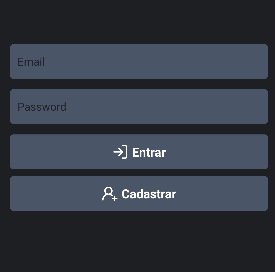
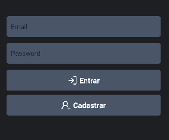
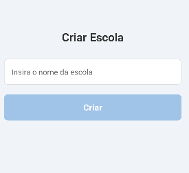
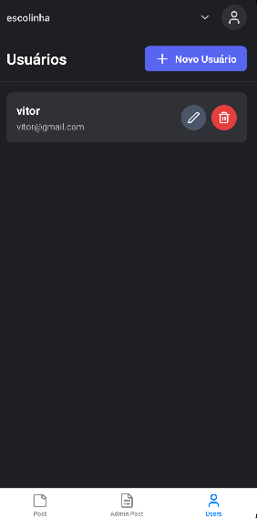
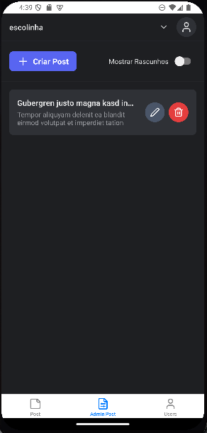
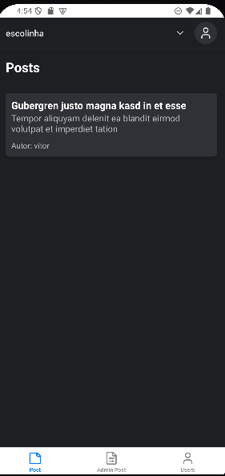
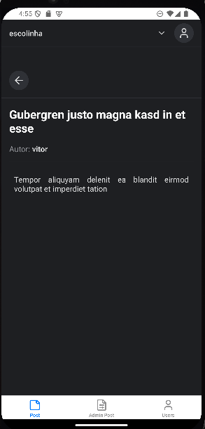

# Integrantes

- Lorenzo Antônio Leite - RM357527
- Vitor Henrique Laia Martins - RM357177
- Fernando Caixeta do Amaral - RM357887
- Ynara Resende de Faria - RM357404

# Problema

Atualmente, a maioria dos professores e professoras da rede pública de educação não possui plataformas adequadas para postar suas aulas e transmitir conhecimento para alunos e alunas de forma prática, centralizada e tecnológica.

O backend desta aplicação já foi desenvolvido e está disponível no seguinte repositório: [Backend](https://github.com/vitorpc4/schoolpost). O frontend mobile foi desenvolvido com base nesse backend e agora oferece uma interface por meio de aplicativo mobile, para os alunos e professores conseguirem acessar a plataforma

# Tecnologias

Backend: NestJS, Express, PostgreSQL

Frontend Mobile: React Native, CSS

# Instalação

O aplicativo foi construído utilizando os recursos oferecidos pelo [expo](https://expo.dev/). Dessa forma é simples executar o projeto usando a stack oferecida pelo expo.

para executar de forma local, primeiro você executar o backend para isso você pode acessar o repositório do backend onde há instruções para sua execução utilizando o docker ou o próprio build. [Backend](https://github.com/vitorpc4/schoolpost)

Com o projeto backend em execução, agora podemos realizar os passos para executar o frontend mobile

```bash

# Clone o repositório
git clone https://github.com/vitorpc4/schoolpostmobile

# Navegue até o diretório do projeto
cd schoolpostmobile

# Renomeie o arquivo .env.example para .env
mv .env.example .env

# Abra o arquivo .env e adicione as variáveis de ambiente da seguinte forma: http://{Endereço}:{porta}
# Exemplo:
EXPO_PUBLIC_API_URL=http://10.0.2.2:3001

# Na pasta raiz, execute o seguinte comando para instalar as dependências
npm install

# Após a instalação dos pacotes, execute o projeto com o comando abaixo
npx expo start

```

# Instrução de uso

1. **Criar Conta**:

Pressione a opção 'Cadastrar'



Preencha o formulário para criar a conta. Após a confirmação, uma notificação será exibida, indicando que a conta foi criada com sucesso. Em seguida, você será redirecionado automaticamente para a tela de login.

2. **Realizar Login**:

Insira os dados de e-mail e senha no formulário e clique na opção "Login". Se as informações forem válidas, você será redirecionado automaticamente:

- Caso seja sua primeira vez no sistema, será direcionado ao formulário de criação de escola.

- Se a conta já estiver vinculada a uma escola, você será redirecionado diretamente para a área de posts da escola.



3. Criando Escola:

A criação da escola é simples: basta inserir um nome e pressionar a opção "Criar". Após isso, o usuário será redirecionado automaticamente para a área de posts.



4. Castrando novos usuários

Para criar novos usuários, basta clicar na opção "Users" localizada na área inferior do smartphone.


- Criar:
  - Para criar um novo usuário, clique em "Novo usuário", preencha o formulário com as informações necessárias e pressione a opção "Criar Usuário".
- Editar:
  - Para editar um usuário, clique no ícone de lápis ao lado do nome do usuário desejado. Um formulário será exibido para que você possa fazer as alterações necessárias.
- Excluír:
  - Para excluir um usuário, clique no ícone de lixeira ao lado do nome do usuário. O sistema solicitará uma confirmação. Após confirmar, o usuário será permanentemente excluído.

5. Criando novos posts

Para criar novos posts, clique na opção AdminPost. Por padrão, são listados apenas os posts publicados. Ao ativar o toggle "Mostrar Rascunhos", você poderá visualizar também os posts não publicados (rascunhos).


- Criar:
  - Ao selecionar a opção "Criar Post", o usuário será redirecionado para uma tela de criação de posts. Nessa tela, basta inserir o título e a descrição do post. Além disso, é possível marcar o post como Rascunho, caso deseje finalizá-lo posteriormente.
- Editar:
  - Para editar um post, basta clicar no ícone de lápis correspondente. Um formulário será exibido, contendo os dados atuais do post. Nessa tela, além de fazer alterações, o usuário também pode remover o status de Rascunho do post, marcando-o como finalizado.
- Excluír:
  - Para excluir um post, clique no ícone de lixeira. O sistema solicitará uma confirmação para garantir que o usuário realmente deseja excluir o post. Caso a exclusão seja confirmada, o post será permanentemente removido.

6. Listagem e leitura de posts

- A funcionalidade de leitura de posts é acessível a todos os tipos de usuários. Nela, é feita uma listagem simples que exibe apenas as postagens não marcadas como rascunho. Ao clicar em um post, o usuário será redirecionado para a tela de leitura, onde poderá visualizar o conteúdo completo.

Listagem de post:


Leitura de post:

